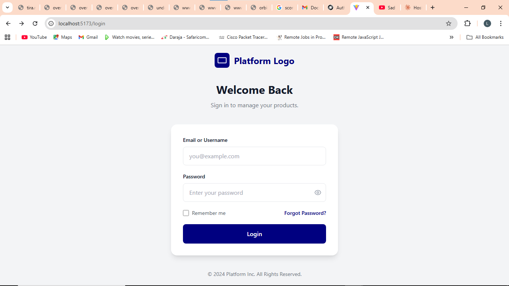
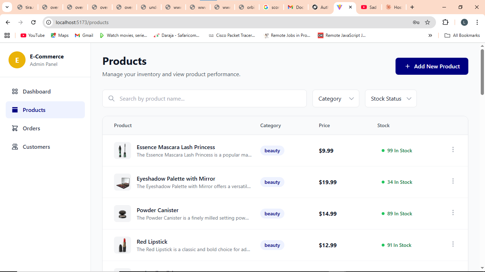
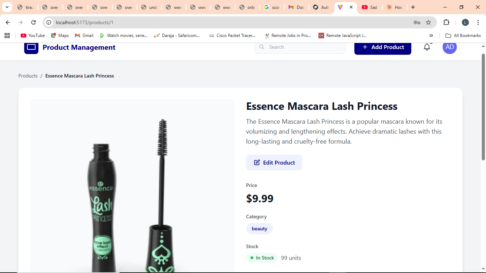
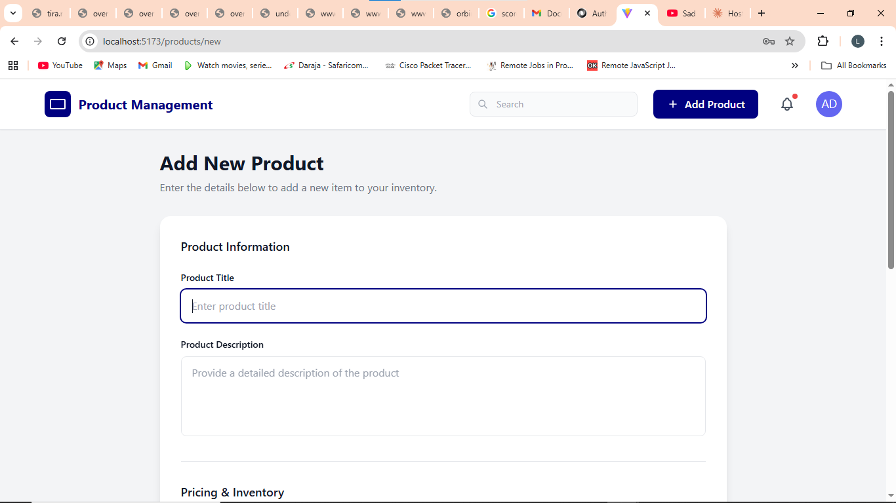

# Product Management Dashboard


Three‑dots menu / action button lets the user view the product details page.




A Vue 3 + Vite application implementing authentication, product browsing, filtering, and CRUD operations using **DummyJSON** as the backend API. The project uses:

* **Vue 3 (Composition API)**
* **Pinia** for state management
* **Vue Router** for navigation
* **TailwindCSS** for styling
* **Axios** for API calls
* Fully responsive layout
* Styled based on provided UI mockups with primary color `#000080`

---

##  Getting Started

### 1. **Clone the Repository**

```bash
git clone https://github.com/linscot10/AlienSoft_Technologies.git
cd vue-task
```

### 2. **Install Dependencies**

```bash
npm install
```

### 3. **Run the Development Server**

```bash
npm run dev
```

This starts the app at:

```
http://localhost:5173
```

---

##  Project Structure

```
src/
├── assets/               # Images, icons, styles
├── components/           # Reusable UI components
│   ├── AppHeader.vue
│   ├── ProductRow.vue
│   ├── Spinner.vue
├── views/                # Main screens
│   ├── LoginView.vue
│   ├── ProductsView.vue
│   ├── ProductView.vue
│   ├── ProductNewView.vue
├── stores/               # Pinia stores
│   ├── auth.js
│   ├── products.js
├── router/               # Vue Router config
│   ├── index.js
├── App.vue               # Root component
├── main.js               # App entry point
```

### Key Concepts

* **Auth Store:** Handles login, session persistence, and redirects.
* **Products Store:** Loads product lists, filters, fetches detail data, and creates/deletes items.
* **Views:** Map 1:1 to the mockups you provided.
* **TailwindCSS:** All styling uses Tailwind, with the primary brand color integrated.

---

##  Environment Variables

No external environment variables are required.
The app uses the public DummyJSON API:

```
https://dummyjson.com
```

If you want to override API URLs, create a `.env` file:

```
VITE_API_URL=https://dummyjson.com
```

---

##  Authentication

DummyJSON requires the following for testing:

**Default Credentials (used if fields are empty):**

```
username: emilys
password: emilyspass
```

The app stores the session in Pinia and redirects unauthorized users back to `/login`.

---

##  Build for Production

```bash
npm run build
npm run preview
```

This generates optimized files in:

```
dist/
```

---

## 🌐 Deploy to GitHub Pages


```

 site is  live at:

```
 https://linscot10.github.io/AlienSoft_Technologies/
```

---


## 📌 Assumptions

* DummyJSON is acceptable as the backend.
* Full CRUD behavior is simulated (Delete + Create are mocked in store).
* Edit screen was optional in instructions and therefore not implemented.
* Styling follows the mockup with the specified primary blue: **#000080**.
* No authentication token refresh is required.
* No backend persistence beyond API simulation.

---

## 📄 License

This project is free to use for technical assessment purposes.

